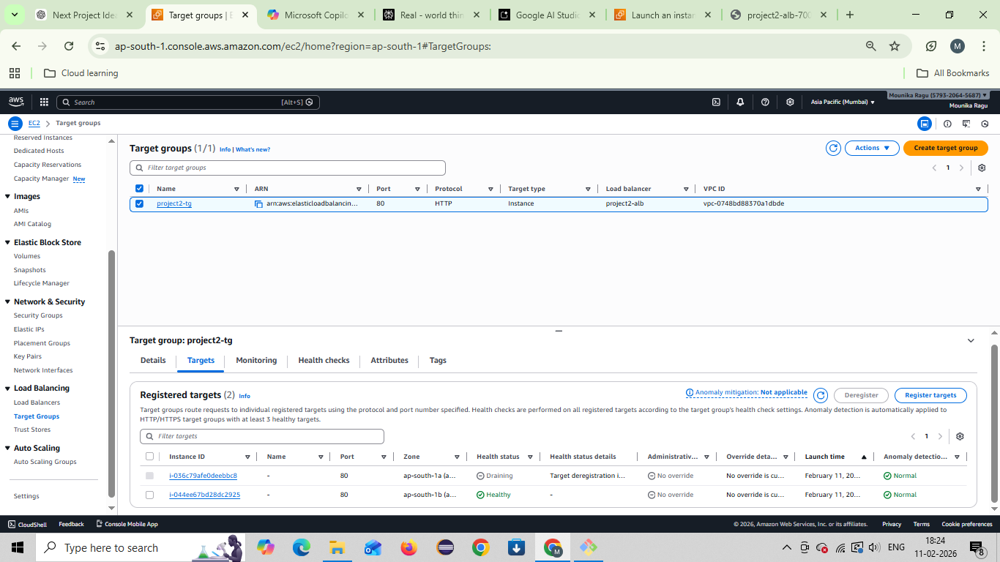

# 🚀 Project-2: Auto Scaling Web Server using AWS

## 📌 Project Overview
This project demonstrates how to deploy a highly available and scalable web application using AWS Auto Scaling Group and Application Load Balancer.

The goal is to ensure that the website remains available even during high traffic by automatically launching or terminating EC2 instances based on demand.

---

## 🛠 Services Used
- Amazon EC2
- Amazon Machine Image (AMI)
- Launch Template
- Auto Scaling Group (ASG)
- Application Load Balancer (ALB)
- Target Group
- CloudWatch Scaling Policy

---

## 🎯 What We Built
✅ A static website hosted on EC2  
✅ Custom AMI created from configured instance  
✅ Launch Template using the AMI  
✅ Auto Scaling Group with Desired Capacity = 2  
✅ Application Load Balancer distributing traffic  
✅ Target Group health checks  
✅ Dynamic Scaling Policy based on CPU utilization  

---

## ⚙️ Architecture Flow

User Request → ALB → Target Group → Auto Scaling EC2 Instances

---

## 📸 Screenshots

### Final Output

### Auto Scaling Group Instances

### Application Load Balancer Active

### Target Group Healthy Targets

### Custom AMI Created

### Scaling Activity

---

## 📚 What I Learned
- How Auto Scaling maintains high availability
- How Load Balancer distributes traffic across instances
- Creating reusable AMIs for automation
- Health checks and Target Group monitoring
- Real-time scaling using CloudWatch policies
- Full end-to-end deployment like real DevOps workflow

---

## ✅ Conclusion
This project is a real-world example of hosting scalable applications on AWS using Auto Scaling and Load Balancing.

It is a strong beginner DevOps/Cloud project that demonstrates core AWS infrastructure skills.

---

